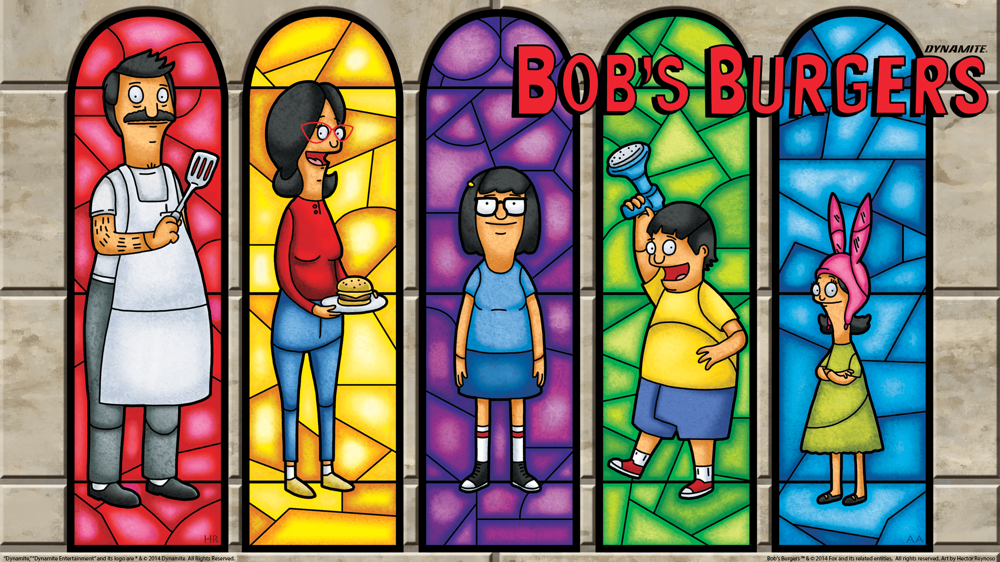

# Bob's Burgers Companion App

  

The Bob's Burgers Companion App is a **React Native** project using **Expo**, the [Bob's Burgers API](https://www.bobsburgersapi.com/) and styled with **Tamagui**. The site's hosted on Netlify if you'd like to check it out:
https://bobsburgerscompanion.netlify.app/ 

(If you click a **character** or **episode** card it will take you to the corresponding wiki page)

If you have any ideas you'd like to see implememted please reach out and let me know!