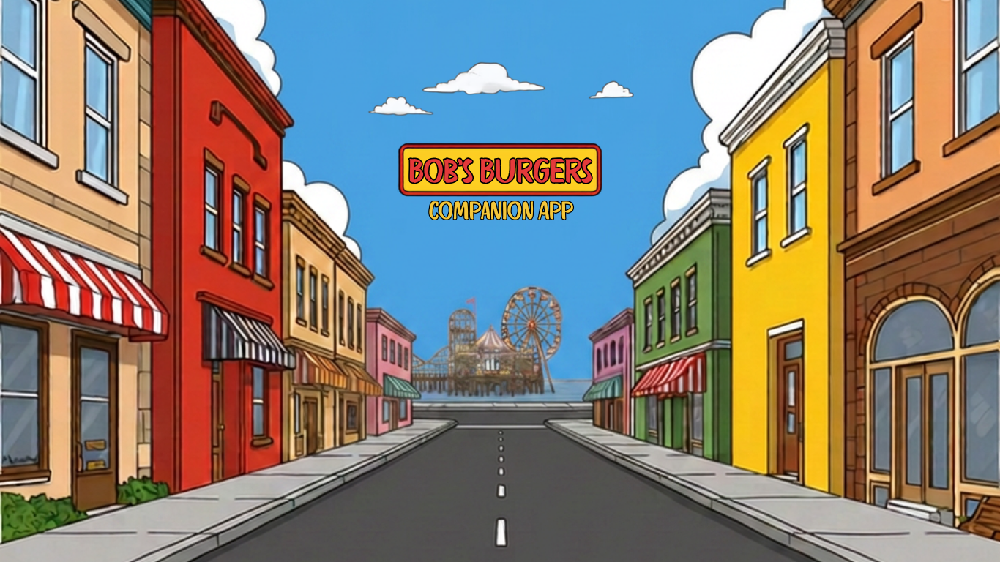

# 🍔 Bob's Burgers Companion App

  

A React Native + Expo app for browsing the world of Bob's Burgers — characters, episodes, and more — built on the [Bob's Burgers API](https://www.bobsburgersapi.com/).

**🌐 Try it live:** [bobsburgerscompanionapp.com](https://bobsburgerscompanionapp.com/) 
*(Tap any card for more info)*

---

## ☕ Support the project

If you enjoy the app, consider buying me a coffee:

---

## 🛠 Built with

- **React Native** + **Expo** — cross-platform (iOS / Android / Web)
- **TypeScript**
- **NativeWind** — styling
- **Node.js / Express** + **PostgreSQL** — backend for profiles & favorites
- **Jest** + **React Native Testing Library** + **Playwright** — testing
- **GitHub Actions** — CI

---

## 💡 Got an idea?

If there's a feature you'd love to see — a screen, a character deep-dive, anything — [open an issue](https://github.com/Colter-Garrison/bobs-burgers-companion-app/issues) or reach out. Fan suggestions welcome!
